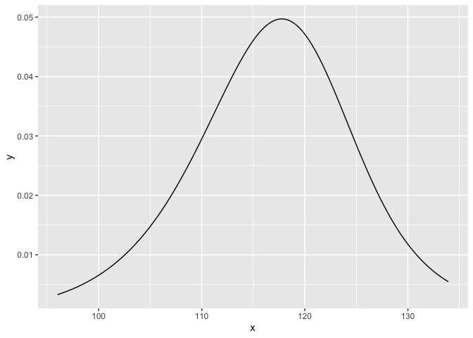
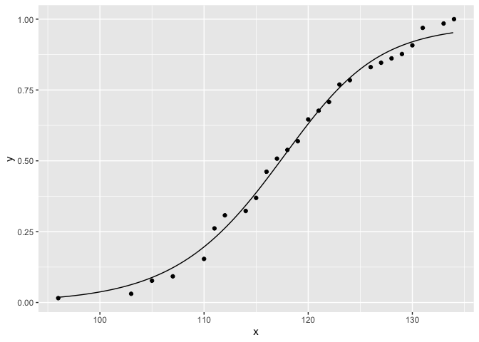

<!-- README.md is generated from README.Rmd. Please edit that file -->

# {nlstimedist}

[](http://www.repostatus.org/#active)
[](https://travis-ci.org/nathaneastwood/nlstimedist)
[](http://www.r-pkg.org/pkg/nlstimedist)
[](http://www.r-pkg.org/pkg/remotes)
[](https://codecov.io/gh/nathaneastwood/nlstimedist)

`{nlstimedist}` fits a biologically meaningful distribution function to
time-sequence data (phenology), estimates parameters to draw the
cumulative distribution function and probability density function and
calculates standard statistical moments and percentiles.

# Installation

You can install:

  - the latest released version from CRAN with

<!-- end list -->

``` r
install.packages("nlstimedist")
```

  - the latest development version from GitHub with

<!-- end list -->

``` r
# install.packages("remotes")
remotes::install_github("nathaneastwood/nlstimedist")
```

# Usage

## Preparing the data

Data should be in tidy format. `{nlstimedist}` provides three example
tidy datasets: `lobelia`, `pupae` and `tilia`.

``` r
head(tilia)
#>   Day Trees
#> 1  94     0
#> 2  95     0
#> 3  96     1
#> 4 103     1
#> 5 104     0
#> 6 105     3
```

We first need to calculate the cumulative number of trees as well as the
proportions. We do this using the `tdData()` function.

``` r
tdTilia <- tdData(tilia, x = "Day", y = "Trees")
tdTilia
#>    Day Trees cumN    propMax
#> 3   96     1    1 0.01538462
#> 4  103     1    2 0.03076923
#> 6  105     3    5 0.07692308
#> 8  107     1    6 0.09230769
#> 10 110     4   10 0.15384615
#> 11 111     7   17 0.26153846
#> 12 112     3   20 0.30769231
#> 14 114     1   21 0.32307692
#> 15 115     3   24 0.36923077
#> 16 116     6   30 0.46153846
#> 18 117     3   33 0.50769231
#> 19 118     2   35 0.53846154
#> 20 119     2   37 0.56923077
#> 21 120     5   42 0.64615385
#> 22 121     2   44 0.67692308
#> 23 122     2   46 0.70769231
#> 24 123     4   50 0.76923077
#> 25 124     1   51 0.78461538
#> 27 126     3   54 0.83076923
#> 28 127     1   55 0.84615385
#> 29 128     1   56 0.86153846
#> 30 129     1   57 0.87692308
#> 31 130     2   59 0.90769231
#> 32 131     4   63 0.96923077
#> 33 133     1   64 0.98461538
#> 34 134     1   65 1.00000000
```

## Fitting the model

We fit the model to the proportion of the cumulative number of trees
(`propMax`) in the `tdTilia` data using the `timedist()` function.

``` r
model <- timedist(data = tdTilia, x = "Day", y = "propMax", r = 0.1, c = 0.5, t = 120)
model
#> Nonlinear regression model
#>   model: propMax ~ 1 - (1 - (r/(1 + exp(-c * (Day - t)))))^Day
#>    data: data
#>         r         c         t 
#>   0.02721   0.17126 124.84320 
#>  residual sum-of-squares: 0.01806
#> 
#> Number of iterations to convergence: 10 
#> Achieved convergence tolerance: 1.49e-08
```

## Extracting the moments

We can extract the mean, variance, standard deviation, skew, kurtosis
and entropy of the model as follows.

``` r
model$m$getMoments()
#>       mean variance       sd     skew kurtosis entropy
#> 1 118.0325 180.7509 13.44436 4.324762 46.82073 5.36145
```

## Extracting the RSS

Similarly we can extract the RSS of the model

``` r
model$m$rss()
#> [1] 0.9930469
```

## Plotting the PDF and CDF

The probability density function (PDF) and the cumulative distribution
function (CDF) of the model have their own plotting functions.

``` r
tdPdfPlot(model)
```

<!-- -->

``` r
tdCdfPlot(model)
#> Called from: tdCdfPlot(model)
#> debug: models <- list(...)
#> debug: modelNames <- do.call(c, lapply(substitute(list(...))[-1], deparse))
#> debug: if (any(S <= 0 | S > 1)) stop("S must be between 0 and 1")
#> debug: modLen <- length(models)
#> debug: if (is.null(S)) S <- rep(1, modLen)
#> debug: S <- rep(1, modLen)
#> debug: if (length(S) != modLen) {
#>     if (length(S) == 1) {
#>         S <- rep(S, modLen)
#>     }
#>     else {
#>         stop(paste0("Expecting the length of S to be either 1 or to match the number of models (", 
#>             modLen, ")."))
#>     }
#> }
#> debug: if (modLen == 1L) {
#>     data <- augment(...)
#>     if (S != 1) 
#>         data$y <- data$y * S
#> } else {
#>     multDat <- augmentMultiple(...)
#>     if (any(S != 1)) 
#>         multDatY <- lapply(seq_along(multDat), function(.) if (S[.] != 
#>             1) 
#>             multDat[[.]]$y * S[.])
#>     data <- do.call(rbind, multDat)
#>     if (any(S != 1)) 
#>         data$y <- do.call(c, multDatY)
#> }
#> debug: data <- augment(...)
#> debug: if (S != 1) data$y <- data$y * S
#> debug: if (is.null(xVals)) xVals <- seq(min(data$x), max(data$x), by = max(data$x)/1000)
#> debug: xVals <- seq(min(data$x), max(data$x), by = max(data$x)/1000)
#> debug: cdfData <- lapply(seq_along(models), function(.) {
#>     params <- models[[.]]$m$getPars()
#>     data.frame(fitted = tdCDF(xVals, params["r"], params["c"], 
#>         params["t"], S = S[.]), x = xVals)
#> })
#> debug: nRowsFit <- lapply(cdfData, nrow)
#> debug: cdfData <- do.call(rbind, cdfData)
#> debug: p <- if (modLen > 1L) {
#>     cdfData$group <- rep(modelNames, as.integer(nRowsFit))
#>     nRows <- as.integer(lapply(multDat, nrow))
#>     data$group <- rep(modelNames, nRows)
#>     ggplot() + geom_point(data = data, aes_string(x = "x", y = "y", 
#>         colour = "group")) + geom_line(data = cdfData, aes_string(x = "x", 
#>         y = "fitted", colour = "group"))
#> } else {
#>     ggplot() + geom_point(data = data, aes_string(x = "x", y = "y")) + 
#>         geom_line(data = cdfData, aes_string(x = "x", y = "fitted"))
#> }
#> debug: ggplot() + geom_point(data = data, aes_string(x = "x", y = "y")) + 
#>     geom_line(data = cdfData, aes_string(x = "x", y = "fitted"))
#> debug: p
```

<!-- -->

# Citation

Franco, Miguel. (2018). The time distribution of biological phenomena –
illustrated with the London marathon. 10.7287/peerj.preprints.27175.
